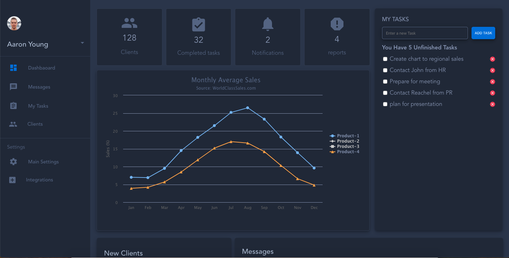
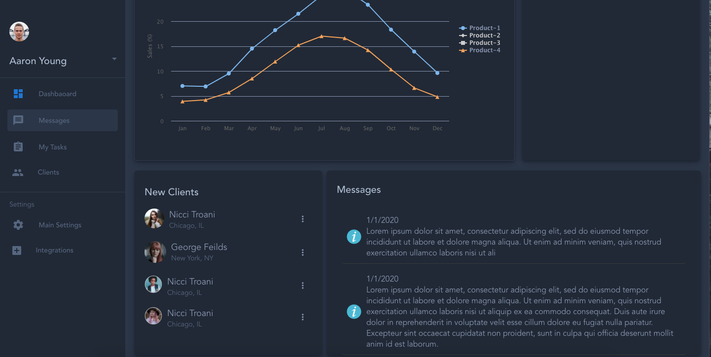

# vue-dashboard

- Simple Vue.js dashboard built using VUE's single clsas component & Flexbox

## Project Structure
* The different sections are divided to components 
* There's 6 Main components
    * Side Bar
    * Notifications
    * Chart
    * Clients 
    * Messages
    * Tasks
* There 2 Wrapper components `ClientsMEssagesContainer` & `NotificationChartContainer` that are used for alignment within other components
* Each component's content is orgenized using Flexbox

## Tecnologies Used
1. Vue.js Frameword
2. Vue's Single class components
3. TypeScript 
4. SASS preprocessor
5. PUG templating engine 
6. Vue CLI
7. NPM 
8. VUEX for state manegement

